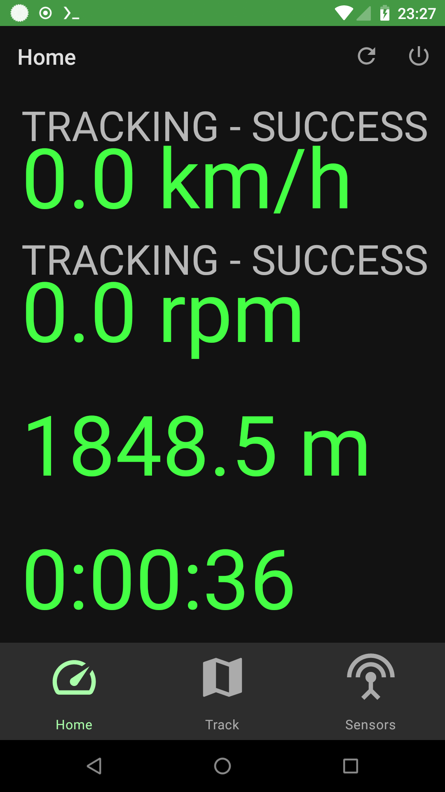

# Biscuit

Biscuit is a rudimentary bike computer, supporting ANT+ speed and
cadence sensors as well as GPS track recording

It started life as a fork of https://github.com/starryalley/CSC_BLE_Bridge/

## TO DO

tl;dr All the things

- prettify the UI
- move sensor status into the sensors tab, switch to it when not TRACKING status
- show current track on map
- allow select some previous track & show on map
- downloaded recorded tracks, ideally as GPX
- better app icon (some day)

## Note to nixpkgs users

NIXPKGS_ALLOW_UNFREE=1  nix-shell -p firefox -p android-studio --run "android-studio ."

----

a sensor has an identity of some kind, e.g. from pcc.getDeviceName() or
"gps" or something else

we do a sensor search for each supported class of sensor. It publishes its
search progress so that the UI can be updated

