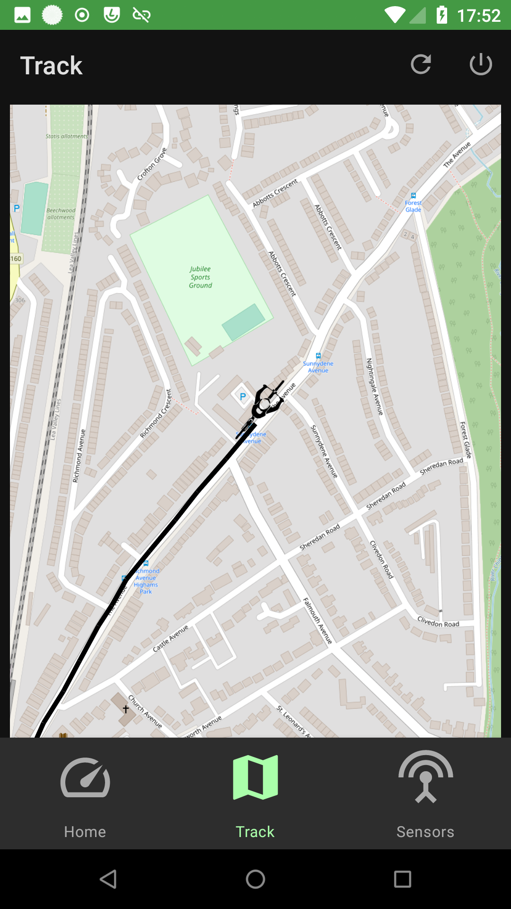
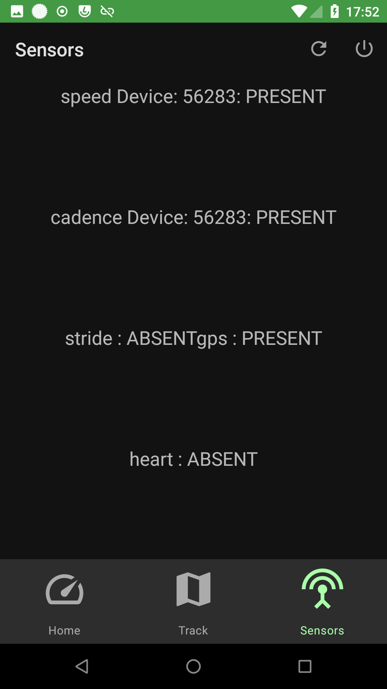
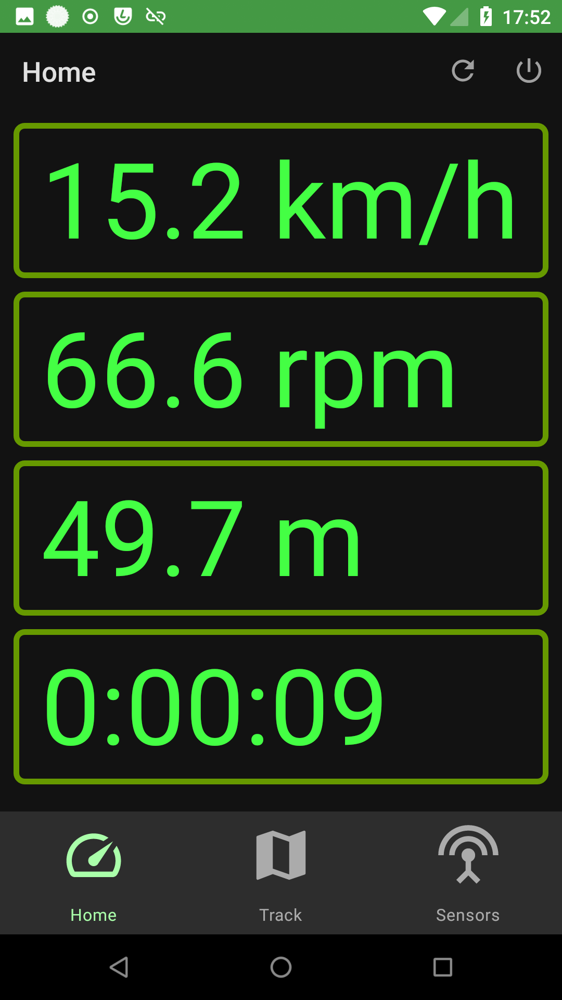

# Biscuit

Biscuit is a rudimentary bike computer, supporting ANT+ speed and
cadence sensors as well as GPS track recording

It started life as a fork of https://github.com/starryalley/CSC_BLE_Bridge/

## TO DO

tl;dr All the things

- prettify the sensor status display
- better contrast on map
- track display should show all the open track
- allow selection some previous track & show on map
- downloaded/share/backup recorded tracks, ideally as GPX
- better app icon
- investigate why tiles slow to load (or not loading)

## Note to nixpkgs users

NIXPKGS_ALLOW_UNFREE=1  nix-shell -p firefox -p android-studio --run "android-studio ."

